<div align="center">


### Software Engineer • Backend (Java/Python) • AI/LLM Engineer

<br/>

<a href="https://linkedin.com/in/Akashmodi371">
  
</a>
<a href="mailto:akashmodi371@gmail.com">
  
</a>
<a href="https://github.com/Akashmodi371">
  
</a>
<a href="https://leetcode.com/akashmodi371">
  
</a>
<a href="https://www.codechef.com/users/akashmodi371">
  
</a>

<br/><br/>


<br/>


</div>

<br/>

---

<br/>


## 🚀 About Me

🎯 **Current Role:** Software Engineer @ **UCH.AI**

📍 **Location:** Bengluru, India 🇮🇳

💼 **Experience:** 2+ years building production systems

🔥 **Specialization:**
- Backend Development (Java, Python)
- AI/LLM Systems & Multi-Agent Orchestration
- Cloud-Native Architecture & Microservices

💡 **Currently Learning:**
- Advanced LLM Orchestration & Fine-tuning
- System Design at Scale (10K+ RPS)
- Distributed Systems Architecture

💬 **Ask me about:**
- System Design & Microservices
- Spring Boot & FastAPI
- AI Automation & LangChain
- Cloud-Native Applications

<br clear="right"/>

---

<br/>

## 💼 Professional Experience

<details open>
<summary><b>🏢 UCH.AI - Software Engineer</b> <i>(Dec 2024 - Present)</i></summary>
<br/>

- 🎯 **Architected** complete Kanban-style task management system from scratch with drag-and-drop functionality
- 🏛️ **Developed** large-scale government tender processing backend using Java (Spring Boot) and Python
- ☁️ **Deployed** fault-tolerant applications on GCP/Azure using Docker, Kubernetes achieving 99.9% uptime
- 📊 **Integrated** OCR pipelines and real-time analytics with Grafana monitoring
- 🔐 **Delivered** secure, compliant solutions for government stakeholders

**Tech Stack:** `Java` `Python` `Spring Boot` `MongoDB` `Docker` `Kubernetes` `GCP` `Azure` `OCR` `Grafana`

</details>

<details>
<summary><b>💻 Enitiate - Software Development Engineer</b> <i>(Nov 2023 - Nov 2024)</i></summary>
<br/>

- ⚡ **Increased** development efficiency by 40% through CI/CD pipeline implementation
- 🔧 **Integrated** GCP services (Cloud Storage, Logging Explorer) for enhanced scalability
- 🐳 **Containerized** applications using Docker with MongoDB for flexible data management
- 🚀 **Contributed** across full SDLC phases ensuring seamless backend integration

**Tech Stack:** `Java 8` `Spring Framework` `GCP` `Docker` `MongoDB` `GitHub Actions` `Cloud Build`

</details>

<details>
<summary><b>🎓 Monocept Consulting - Software Engineer Intern</b> <i>(May 2023 - Nov 2023)</i></summary>
<br/>

- 🌐 **Led** key web development projects demonstrating full-stack capabilities
- 🐛 **Resolved** critical bugs improving application performance by 25%
- 🤝 **Collaborated** in cross-functional teams for software development and maintenance

**Tech Stack:** `Java` `Spring Boot` `React` `MySQL` `REST APIs`

</details>

<br/>

---

<br/>

## 🎯 Featured Projects

### 🤖 Multi-Agent AI Customer Support System

  

**Problem Statement:** Traditional customer support systems struggle with intelligent routing, context retention, and scaling to handle thousands of queries efficiently.

**Solution:** Built an intelligent multi-agent orchestration system using Google ADK and LangChain that autonomously handles customer queries with human-level accuracy.

```mermaid
graph TB
    A[Customer Query] --> B{AI Router Agent<br/>95% Accuracy}
    B -->|Billing Issue| C[💰 Billing Agent]
    B -->|Technical Problem| D[🔧 Technical Agent]
    B -->|Refund Request| E[💳 Refund Agent]
    C --> F[(MongoDB<br/>Context Memory)]
    D --> F
    E --> F
    F --> G[🎯 Response<br/>2-3s Latency]
    
    style A fill:#3B82F6,stroke:#1E40AF,color:#fff
    style B fill:#8B5CF6,stroke:#6D28D9,color:#fff
    style G fill:#10B981,stroke:#059669,color:#fff
    style F fill:#F59E0B,stroke:#D97706,color:#fff
```

<details>
<summary><b>🔍 Technical Architecture</b></summary>



</details>

**Key Features:**
- ✅ **Intelligent Routing:** 95%+ classification accuracy using fine-tuned models
- ✅ **Context-Aware Memory:** MongoDB-backed conversation history for personalized responses
- ✅ **Microservices Architecture:** Spring Cloud Gateway orchestrating Java & Python services
- ✅ **High Performance:** Handles 10,000+ tickets/day with sub-3 second response time
- ✅ **Containerized Deployment:** Full Docker Compose setup for easy scaling

**Business Impact:**
- 📈 Increased automation from 20% → **70%**
- ⚡ Reduced average response time to **2-3 seconds**
- 💰 Decreased support costs by **60%**
- 😊 Achieved **95%+ customer satisfaction**

**Tech Stack:** `Java 21` `Spring Boot` `Python` `FastAPI` `Google ADK` `LangChain` `LangGraph` `MongoDB` `Docker` `Gradle`

**Links:** [Live Demo](#) • [Documentation](#) • [GitHub Repo](#)

<br/>

### 🏛️ Government Tender Processing Platform

  

**Overview:** Large-scale tender management system processing thousands of government tenders with real-time data pipelines and advanced analytics.

**Key Contributions:**
- 📋 **Backend Infrastructure:** Complete Java & Python backend with RESTful APIs
- 🔄 **Real-time Processing:** Event-driven architecture for instant tender updates
- 🛡️ **High Availability:** Kubernetes cluster deployment with auto-scaling
- 🔐 **Security & Compliance:** Government-grade security standards and data encryption
- 📊 **Analytics Dashboard:** Real-time insights using Grafana and custom metrics

**Architecture Highlights:**
- Microservices-based distributed system
- MongoDB for flexible tender data storage
- Kubernetes orchestration on GCP/Azure
- OCR integration for document processing
- Comprehensive logging and monitoring

**Tech Stack:** `Spring Boot` `Python` `MongoDB` `Kubernetes` `GCP` `Azure` `OCR` `Grafana` `Docker`

<br/>

---

<br/>

## 🛠️ Technical Skills

<div align="center">

### **Languages & Frameworks**

<table>
<tr>
<td align="center" width="96">

<br/>Java
</td>
<td align="center" width="96">

<br/>Python
</td>
<td align="center" width="96">

<br/>Spring Boot
</td>
<td align="center" width="96">

<br/>FastAPI
</td>
<td align="center" width="96">

<br/>React
</td>
<td align="center" width="96">

<br/>JavaScript
</td>
</tr>
</table>

### **Databases & Storage**

<table>
<tr>
<td align="center" width="96">

<br/>MongoDB
</td>
<td align="center" width="96">

<br/>MySQL
</td>
<td align="center" width="96">

<br/>PostgreSQL
</td>
<td align="center" width="96">

<br/>Redis
</td>
</tr>
</table>

### **Cloud & DevOps**

<table>
<tr>
<td align="center" width="96">

<br/>Docker
</td>
<td align="center" width="96">

<br/>Kubernetes
</td>
<td align="center" width="96">

<br/>GCP
</td>
<td align="center" width="96">

<br/>Azure
</td>
<td align="center" width="96">

<br/>GitHub Actions
</td>
<td align="center" width="96">

<br/>Git
</td>
</tr>
</table>

### **AI/ML & Tools**

<table>
<tr>
<td align="center" width="96">

<br/>LangChain
</td>
<td align="center" width="96">

<br/>OpenAI
</td>
<td align="center" width="96">

<br/>Gradle
</td>
<td align="center" width="96">

<br/>Linux
</td>
<td align="center" width="96">

<br/>VS Code
</td>
<td align="center" width="96">

<br/>IntelliJ
</td>
</tr>
</table>

</div>

<br/>

---

<br/>

## 📊 GitHub Analytics

<!-- <div align="center">

<a href="https://github.com/Akashmodi371">
  
</a>
<a href="https://github.com/Akashmodi371">
  
</a>

</div> -->

<!-- <br/>

<div align="center">
  <a href="https://github.com/Akashmodi371">
    
  </a>
</div> -->

<br/>

<div align="center">
  <a href="https://github.com/Akashmodi371">
    
  </a>
</div>

<br/>

<div align="center">
  <a href="https://github.com/Akashmodi371">
    
  </a>
</div>

<br/>

---

<br/>

## 🏆 Achievements & Certifications

<table>
<tr>
<td width="50%" valign="top">

### 🎯 Competitive Programming

<br/>

🥇 **Top 1% Global Rank**
- Rank: **116 / 16,000+**
- Contest: CodeChef Starter 73
- Max Rating: **1757** ⭐

<br/>

🚀 **Google Kickstart 2022**
- Round E: Rank **7,669**
- Global Programming Contest

<br/>

💻 **Problem Solving**
- **500+ problems** solved on LeetCode
- **Active** on GeeksforGeeks
- Maintained DSA repository on GitHub

</td>
<td width="50%" valign="top">

### 📚 Professional Certifications

<br/>

✅ **Java Full Stack Development**
- Swabhav Techlabs (Nov 2023)

<br/>

✅ **Spring Boot 3 & JPA/Hibernate**
- Udemy (May 2024)

<br/>

✅ **Spring Security (JWT, OAuth2)**
- Udemy (Jun 2024)

<br/>

✅ **Microservices with Docker & Kubernetes**
- Udemy (Aug 2024)

<br/>

✅ **Intro to LLMs & LangChain**
- Specialized Course (Apr 2025)

</td>
</tr>
</table>

<br/>

---

<br/>

## 🎓 Education

<table>
<tr>
<td width="20%" align="center">

</td>
<td width="80%">

### Bachelor of Technology in Computer Science and Engineering

**Rajiv Gandhi Prodyogiki Vishwavidyalaya** • Graduated: June 2023

**Relevant Coursework:**
- Data Structures & Algorithms
- Object-Oriented Programming (Java, C++)
- Database Management Systems
- Operating Systems
- Computer Networks
- Software Engineering & System Design

</td>
</tr>
</table>

<br/>

---

<br/>

## 🌟 What I'm Working On

<table>
<tr>
<td width="33%" valign="top">

### 📚 Learning

- Advanced LLM fine-tuning
- Prompt engineering techniques
- Distributed systems (10K+ RPS)
- FAANG system design patterns
- Vector databases (Pinecone)
- Real-time streaming (Kafka)

</td>
<td width="33%" valign="top">

### 🛠️ Building

- AI-powered automation tools
- High-performance microservices
- Developer productivity enhancers
- Multi-agent orchestration systems
- Cloud-native applications
- Open-source contributions

</td>
<td width="33%" valign="top">

### 💼 Open To

- Backend Engineering (Java/Python)
- AI/LLM Engineering roles
- System Design positions
- Open source collaborations
- Technical mentorship
- Freelance projects

</td>
</tr>
</table>

<br/>

---

<br/>

## 📬 Let's Connect

<div align="center">

<table>
<tr>
<td align="center" width="33%">

### 💼 Professional

<a href="https://linkedin.com/in/Akashmodi371">

</a>

<br/><br/>

<a href="mailto:akashmodi371@gmail.com">

</a>

</td>
<td align="center" width="33%">

### 💻 Coding Platforms

<a href="https://leetcode.com/akashmodi371">

</a>

<br/><br/>

<a href="https://www.codechef.com/users/akashmodi371">

</a>

</td>
<td align="center" width="33%">

### 🌐 Portfolio & More

<a href="https://github.com/Akashmodi371">

</a>

<br/><br/>

<a href="#">

</a>

</td>
</tr>
</table>

<br/>

### 💡 Collaboration Interests

```yaml
Looking for:
  - Backend Development Projects
  - AI/ML Integration Challenges  
  - Open Source Contributions
  - System Design Discussions
  - Tech Mentorship Opportunities
```

<br/>

### ⚡ Fun Fact

**"Code is poetry written for machines to execute and humans to understand."** ✨

<br/>

<sub>**Status:** ✅ Open to interesting opportunities • 🚀 Building amazing products • 💬 Always happy to help</sub>

<br/><br/>

⭐️ From [Akashmodi371](https://github.com/Akashmodi371) with ❤️

<br/>


</div>
